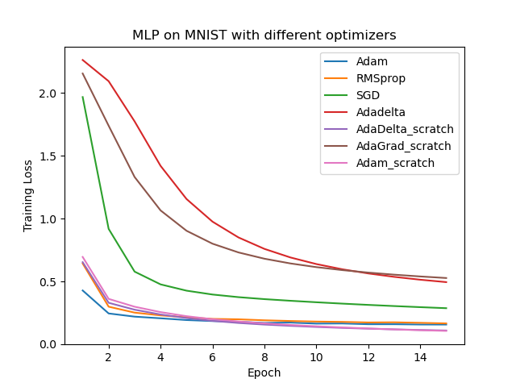

# Report

## ADAM: A Method for Stochastic Optimization

### Team: 43

- Aryan Kharbanda (2019101018)
- Tushar Jain (2019101091)
- S Murali Mukunda Bhat (2019115006)
- Priyanshul Govil (2021121002)


[GitHub Link](https://github.com/aryankharbanda/ewwADAM): Restricted access - invite already shared with TA.

# Submission

## Directory Structure

```
.
├── ADAM.py
├── AdaDelta.py
├── AdaGrad.py
├── CNN_cifar10
│   ├── CNNCIFAR10.ipynb
│   ├── CNN_CiFar10.png
│   ├── Screenshot.jpg
│   ├── data
│   ├── optimizers
│   ├── results
│   └── saved_models
├── LR_imdb
│   ├── IMDB_LogisticRegression.ipynb
│   ├── LR_imdb.png
│   ├── Screenshot.jpg
│   ├── optimizers
│   └── saved_models
├── LR_mnist
│   ├── LR_mnist.png
│   ├── MNIST_LogisticRegression.ipynb
│   ├── Screenshot.jpg
│   ├── data
│   ├── optimizers
│   ├── output.png
│   └── saved_models
├── MLP_mnist
│   ├── MLP_MNIST.png
│   ├── MNIST_MLP.ipynb
│   ├── Screenshot.jpg
│   ├── data
│   ├── optimizers
│   └── saved_models
├── Momentum.py
├── mid-eval
│   ├── ADAM.py
│   ├── MNIST_LogisticRegression.ipynb
│   ├── data
│   ├── logisticMNIST.png
│   ├── mid-eval-ppt.pdf
│   └── saved_models
├── report.md
└── report.pdf

19 directories, 23 files
```

# Introduction

Optimizers play a very important role in the world of AI. They are the backbone of the learning processes which is as important as the loss function itself. In the language of commons, they tell the model what to learn from a given experience (experience being the loss). Gradient descent was the first-ever optimizer, introduced or rather suggested by Cauchy in 1847. Since the advent of backpropagation, AI picked up speed, and scientists have made attempts on a regular basis to
solve and find the best optimizers for fast and robust training. This lead to the development of various optimizers such as:

1. SGD
2. Momentum
3. Nesterov Accelerated GD
4. ADAGRAD
5. ADADELTA
6. RMSprop
7. ADAM

Each of them have a few variations too but are broadly classified above. All of these functions try to reach the minima of the loss function curve and how they do it is where they differ for example SGD has a constant learning rate and it tries to reach minima and it has a few issues too. Adam was proposed by considering the best of Adagrad and RMSprop and it solves issues raised because of them and is considered in general to be the best optimizer with minimal training loss
and calculations.

$m_t \leftarrow \beta_1 m_{t-1} + (1- \beta_1) g_t$
- Update biased first-moment eastimate (Equation 1)

$v_t \leftarrow \beta_2 v_{t-1} + (1-\beta_2) g_t^2$
- Update biased second raw moment estimate (Equation 2)

Equation 1 is from Adadelta which is the new learning parameter so the learning parameter is dependent on previous parameter and also current derivative.

Equation 2 is from RMSprop as we use a square of derivatives instead of derivatives for values to see the change in step.

The update step of Adam after scaling $m_t$ and $v_t$ appropriately using these equations

$m_t^1 \leftarrow m_t / (1 - \beta_1^t)$
- Compute bias-corrected first moment estimate

$v_t^1 \leftarrow v_t / (1 - \beta_2^t)$
- Compute bias-corrected second raw moment estimate

Update step:

$$
\theta_t \leftarrow \theta_{t-1} - \alpha \frac{m_t^1}{\sqrt{v_t^1} + \epsilon}
$$

In this study, we try to prove the claims made by the 2015 paper which introduced Adam. In addition to the general results, we also went a bit further and compared various optimizers and their performances on 3D polynomial terrains.

# Datasets and Models

We tried to prove the claims made in experiments showing how Adam performed better in a few use cases. We recreated them using Adam_scratch (which is Adam our implementation of Adam from scratch).

**For each subsection, the first image is the results from the paper, and the second image is our results.**

## Logistic Regression over IMDB dataset (Section 6.1 of the paper)

We implemented logistic regression to classify the IMDB dataset and the results were as follows


## Logistic Regression over MNIST dataset (Section 6.1 of the paper)

We implemented logistic regression to classify MNIST dataset and the results were as follows


## Multi-layer NN with ReLU activation function (Section 6.2 of the paper)

We implemented an MLP with 3 layers (layer 1: 64 units, layer 2: 32 units, output layer: 10 units). ReLU activation was applied to the first 2 layers, and no activation was applied to the output layer.

The results are as follows




## CNN (Section 6.3 of the paper)

We implemented a convolutional neural network with three alternating stages of 5x5 convolution filters and 3x3 max pooling with a stride of 2 that are followed by a fully connected layer of 256 rectified linear hidden units (ReLUs). We used 256 ReLUs instead of 1000 as mentioned in the paper due to computational limitations.

We used CIFAR-10 to test this model. The results are as follows


# Experimental Conditions and Constants

1. For repeatability, we used the same seed for all the optimizers while initializing the weights in PyTorch.
2. Our implementation of Adam differed a bit from PyTorch's in-built implementation in almost every experiment. Although the implementations were similar (both based on the same paper), PyTorch's implementation had some additional features such as:
    
    - L2 Regularization via weight decay option (which was never used so it shouldn't be a problem)
    - AMSGRAD (offering guaranteed convergence)

    We did not implement these as they were not proposed in the original paper.

3. We plotted PyTorch's in-built Adam too in all of the above graphs to compare our implementation with it
4. Due to limited computing capabilities and time, we discarded our planned experiments on heavy and deep networks to test the gradient flow in various optimizers (and the problems of exploding and vanishing gradients).


# Observations and Analysis

1. Adam did perform better compared to other optimizers on these models and datasets as claimed in the paper which can be explained by the idea that Adam takes the best aspects from existing optimizers.
2. Our implementation almost always differed from PyTorch's in each of the above experiments. We suspect this to be due to floating points and rounding-offs, as PyTorch's implementation stores these gradients in lists and passes them to another function before using them to update the weights while our's didn't. This difference was not really noticeable in most cases.
3. Sometimes, SGD converged much quickly than Adam. Since the number of epochs was low, this conclusion shouldn't be taken. However, we could say for sure that SGD had better first steps and was faster than Adam in the initial phases of training. This will happen when the initial terrain has very large gradients (in such case, greedy SGD moves faster, while Adam takes time to pick up speed (controlled by the momentum factor in the numerator)).
4. Adam outperforms SGD in cases where there are large regions of near plain terrain in the optimization problems. In most other cases (ignoring deep networks as we didn't test them), SGD was very competitive with ADAM (SGD was reliably the second-best optimizer among the ones chosen by us in these experiments).


# Conclusion

There are many optimizers to choose from - few are adaptive (like Adam, Adadelta, RMSprop) and others are not (like SGD). The paper claimed and compared training loss and showed how Adam converges quicker. However, this doesn't mean the model and updated weights are the best because when compared with a validation error, and accuracy there are some differences between the models and in most cases even when SGD takes a lot of time and energy it performs better eventually.

This doesn't mean that we have to use SGD all the time because it isn't that worthy either - based on the situation, we have to choose an optimizer... if the data is sparse, we waste time if we use nonadaptive methods like SGD; in those cases, we can use adaptive methods like Adam or Adadelta or RMSprop.

# Work Distribution

- MLP for MNIST: Aryan
- Adam and other optimizers: Tushar
- CNN for CIFAR-10: Aryan, Priyanshul
- LR for MNIST: Murali
- LR for IMDB: Murali
- Report: Priyanshul, Tushar

---
